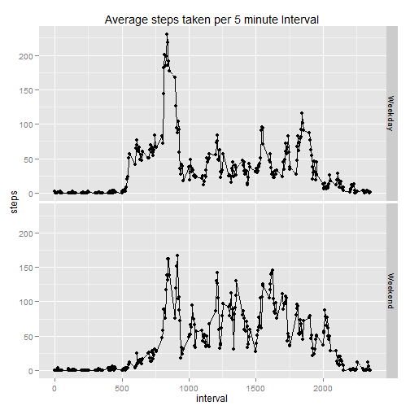

```r
library(knitr)
opts_chunk$set(fig.path='Figs/', warning=FALSE, message=FALSE)
```
# Title: Analysis of Activity Monitoring Data
## Author: William Voorhees
## Date: 14 December 2014

The activity monitoring data can be downloaded from this [website](https://d396qusza40orc.cloudfront.net/repdata%2Fdata%2Factivity.zip).

Once the dataset is unzipped in the working directory, the following code reads in the data and
using the lubridate package will transform the date variable into a POSIXct class variable.


```r
activity<-read.csv("activity.csv", header=T)
library(lubridate)
activity$date<-ymd(activity$date)
```

The following code creates a new dataframe that sums the number of steps taken by date and draws a
histogram of the total number of steps taken each day.


```r
library(data.table)
attach(activity)
activity<- data.table(activity)
activity.sum<-activity[,sum(steps), by=date]
activity.sum<- as.data.frame(activity.sum)
activity.sum$steps<-activity.sum$V1
activity.sum<-activity.sum[,c(1,3)]
attach(activity.sum)
```

```r
hist(steps, xaxt="n")
axis(side=1, at=axTicks(1), 
     labels=formatC(axTicks(1), format="d", big.mark=',')) #format the x-axis so 10,000 has a comma
```

 

The mean and median total number of steps taken per day are calculated and reported here.


```r
mean(steps, na.rm=T)
```

```
## [1] 10766.19
```

```r
median(steps, na.rm=T)
```

```
## [1] 10765
```

The following code creates a new dataframe that averages the number of steps taken by 5-minute 
interval, and plots the data in a time series plot. Missing values are ignored.


```r
attach(activity)
activity1<-na.omit(activity) #main dataset with missing values omitted
activity.avg<-activity1[,mean(steps), by=interval]
activity.avg<- as.data.frame(activity.avg)
activity.avg$steps<-activity.avg$V1
activity.avg<-activity.avg[,c(1,3)]
attach(activity.avg)
```

```r
plot(interval, steps, type="l", main = "Average steps taken per 5 minute Interval")
```

 

On average the 5-minute interval beginning at 08:35 AM contains the most steps as shown below.


```r
interval[which.max(steps)]
```

```
## [1] 835
```

The total number of missing values in the dataset (i.e. the total number of rows with NAs) is 
calculated here.


```r
sum(!complete.cases(activity))
```

```
## [1] 2304
```

Missing values were replaced in the dataset with the mean for that 5-minute interval and it was 
verified that the new dataset does not have missing values.


```r
activity.imputed<-merge(activity, activity.avg, by="interval")
for (i in 1:17568){
        if (is.na(activity.imputed$steps.x[i]) == TRUE) {
                activity.imputed$steps.x[i] <- activity.imputed$steps.y[i]
}}
activity.imputed<-as.data.frame(activity.imputed)
activity.imputed$steps<-activity.imputed$steps.x
activity.imputed<-activity.imputed[,c(1,3,5)]
sum(!complete.cases(activity.imputed)) #verify no missing values
```

```
## [1] 0
```

Using the dataframe with imputed values, the following code creates a new dataframe that sums the
number of steps taken by date and draws a histogram. The mean and median number of steps taken per 
day are also recalculated.  


```r
attach(activity.imputed)
activity.imputed<- data.table(activity.imputed)
activity.imputed.sum<-activity.imputed[,sum(steps), by=date]
activity.imputed.sum<- as.data.frame(activity.imputed.sum)
activity.imputed.sum$steps<-activity.imputed.sum$V1
activity.imputed.sum<-activity.imputed.sum[,c(1,3)]
attach(activity.imputed.sum)
```

```r
hist(steps, xaxt="n")
axis(side=1, at=axTicks(1), 
     labels=formatC(axTicks(1), format="d", big.mark=',')) #format the x-axis so large numbers are 
```

 

```r
                                                            #formatted with commas (ie: 10,000)

mean(activity.imputed.sum$steps)
```

```
## [1] 10766.19
```

```r
median(activity.imputed.sum$steps)
```

```
## [1] 10766.19
```

Notice that the mean and median are identical. The missing values occured in full day chunks so 
those days were imputed to equal to the mean. These can be compared to the mean and median 
calculated earlier while ignoring missing values. The mean values are identical again because 
the missing values occured in full day chunks. The median values are only slightly different.    

The following code creates a new factor variable in the dataset with two levels, weekday and 
weekend indicating whether a given date is a weekday or weekend.


```r
activity.imputed$day<-weekdays(activity.imputed$date)

for (i in 1:17568){
        if (activity.imputed$day[i] == "Saturday") {
                activity.imputed$day[i] <- "Weekend"
        }
        else if (activity.imputed$day[i] == "Sunday") {
                activity.imputed$day[i] <- "Weekend"}
        else { activity.imputed$day[i] <- "Weekday"
}}
```

A panel plot is produced containing a time series plot of the 5-minute intervals (x-axis) and the 
average number of steps taken, averaged across all weekday days or weekend days (y-axis).


```r
attach(activity.imputed)
activity.imputed.avg<-activity.imputed[,mean(steps), by=c("interval","day")]
activity.imputed.avg<- as.data.frame(activity.imputed.avg)
activity.imputed.avg$steps<-activity.imputed.avg$V1
activity.imputed.avg<-activity.imputed.avg[,c(1,2,4)]
attach(activity.imputed.avg)
```

```r
qplot(interval, steps, data=activity.imputed.avg, geom= c("point", "line"), facets= day~., 
      main = "Average steps taken per 5 minute Interval")
```

 
